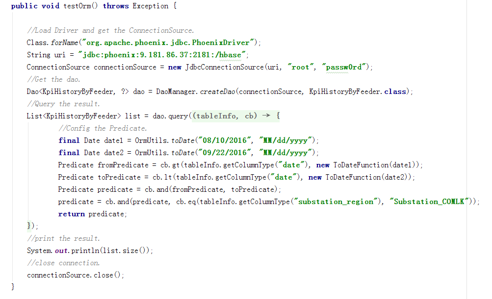
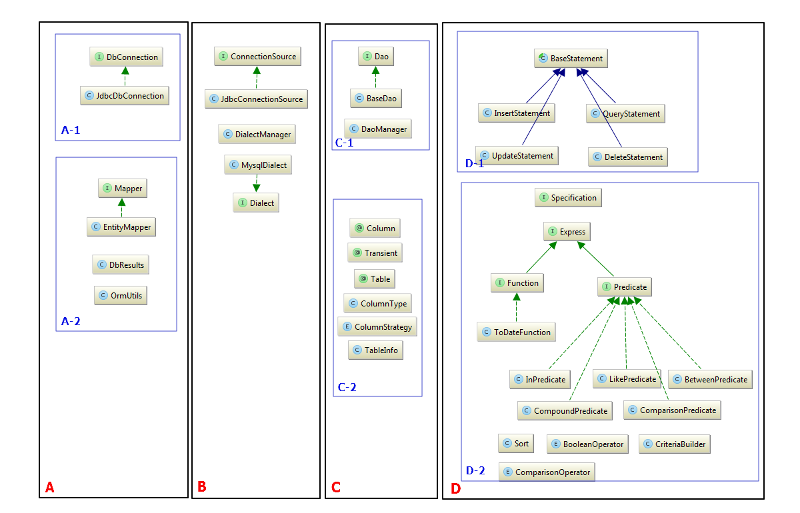

第三章 ORM
=====

##设计目标
ORM(Object Relation Mapping)顾名思义是对象关系映射，即将java对象和数据库中的表进行映射，一个对象实例对应着数据库表中的一条记录。ORM就是为了简化JDBC，将对数据库的操作都封装到DAO(Data Access Object)中，达到可以不写原生SQL就可以对数据库进行增删改查操作，同时保证数据安全，无SQL注入等漏洞。

##使用实例

上面的代码片段中显示，使用ORM进行查询只需要以下步骤即可。

1.加载数据库驱动

2.根据数据库信息的uri获取到一个ConnectionSource

3.根据ConnectionSource和一个Java对象从DaoManager中获取到一个DAO实例

4.根据查询条件组装一个Predicate，然后使用DAO获取到对象的一个数组

5.关闭ConnectionSource

## 类图及流程设计

如上图所示:

ORM大致的调用过程是 A->B->C->D->A，每个区域具体如下：

A:将java.sql包下的Connection 和 ResultSet 进行封装，A-1 使得ORM可以在A中通过一个Sql语句的statement对数据库进行增删改查。A-2 使得查询到的结果通过Mapper的处理可以转化为Java对象

B:定义了Dialect，用来区分不同的数据库驱动，比如有MysqlDialect,PhoenixDialect，因为不同的驱动可能组装出来的sql语句是不一样的，同时这里通过ConnectionSource来管理Dialect和DbConnection，在ORM中ConnectionSource就包含了数据库连接的所有信息。

C:C-2 通过Java对象的Class映射出表在数据库中的结果，包括字段名称，主键，字段类型等信息,这些信息存放在TableInfo中； C-1 则是通过TableInfo和ConnectionSource来获取到一个DAO，用户所有的增删改查操作都是通过这个DAO来实现的。

D:这部分主要是构建SQL语句,D-1可以获取不同操作的SQL语句，D-2则主要是为查询语句做准备的，在这里可以方便地组装出WHERE,ORDER BY,LIMIT等查询条件。

总结而言

ORM 首先通过用户传入的uri,构建出 ConnectionSource,然后根据java对象获取到在数据库中对应的表结构，再根据ConnectionSource获取到DAO，用户根据自己具体的查询条件，组装一个Predicate，Orm用这个Predicate通过一个BaseStatement获取到相应的SQL语句，然后在DbConnection中执行这条语句，执行语句得到的结果在DbResult中用Mapper渲染成Java对象或对象数组，最后再将这个对象或者数组返回给用户，一个数据库的操作过程就完成了。

